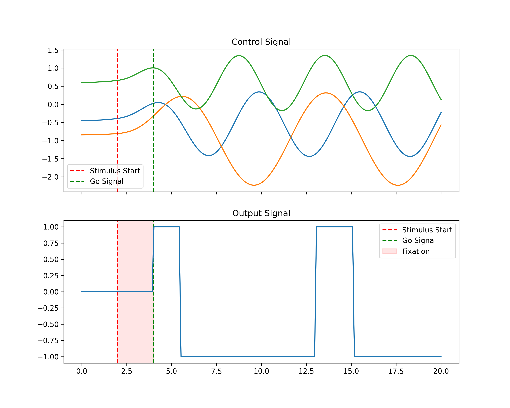

# NDEs for modelling simulated neural systems.

The simulated neural system is simplified Wilson-Cowan model that is trained to simulate a delay-go task in neuroscience experiments. The model generates  behavioural observations as seen in the Figure based on an input control signal. The model also outputs neural spikes. 

The goal here is to develop a framework to model and control this surrogate brain using neural differential equations.

ß
